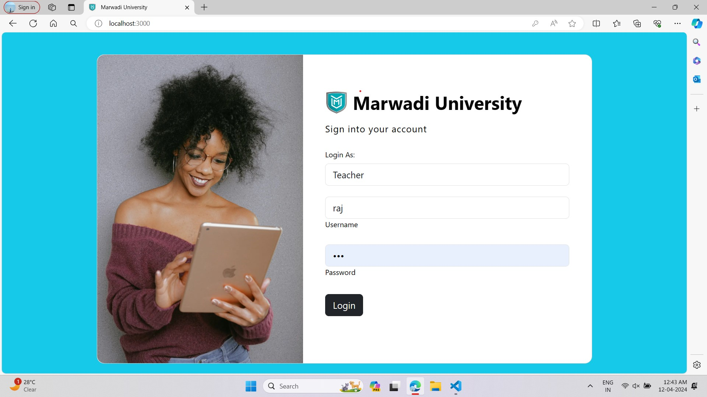

# student-performance-tracking
Developed a web application using HTML, CSS, JavaScript, Node.js, and MongoDB to manage student 
performance. Teachers can add student details, manage timetables, record marks, track attendance, and view 
all records. Students can access their results, including marks and attendance. Ensured a user-friendly 
system for efficient academic management.
## images

